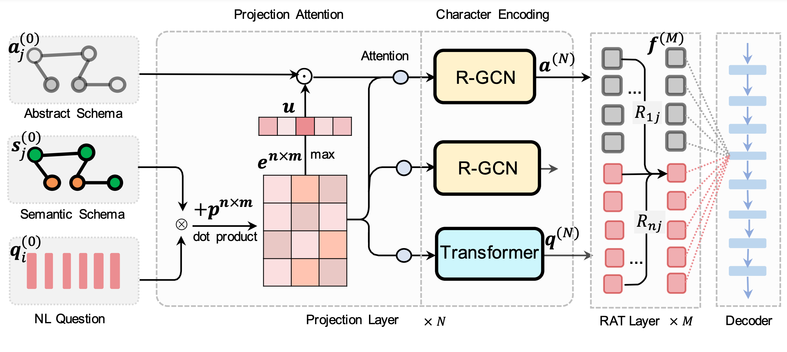

# ShadowGNN
Code for our NAACL'21 accepted paper: [ShadowGNN: Graph Projection Neural Network for Text-to-SQL Parser](https://arxiv.org/pdf/2104.04689.pdf)

<p align='center'>
  
</p>

## Environment Setup

* `Python3.6`

Install Python dependency via `pip install -r requirements.txt` when the environment of Python and Pytorch is setup.

## Running Code

##### Generating train/dev data by yourself
You could process the origin [Spider Data](https://drive.google.com/uc?export=download&id=11icoH_EA-NYb0OrPTdehRWm_d7-DIzWX) by your own. Download  and put `train.json`, `dev.json` and 
`tables.json` under `./data/` directory and follow the instruction on `./preprocess/`

#### Training

Run `train.sh` to train ShadowGNN.

`sh train.sh`

#### Testing

Run `eval.sh` to eval ShadowGNN.

`sh eval.sh`


#### Evaluation

You could follow the general evaluation process in [Spider Page](https://github.com/taoyds/spider)


## Citation

If you use ShadowGNN, please cite the following work.

```
@inproceedings{chen2021shadowgnn,
  title={ShadowGNN: Graph Projection Neural Network for Text-to-SQL Parser},
  author={Chen, Zhi and Chen, Lu and Zhao, Yanbin and Cao, Ruisheng and Xu, Zihan and Zhu, Su and Yu, Kai},
  booktitle={Proceedings of the 2021 Conference of the North American Chapter of the Association for Computational Linguistics: Human Language Technologies},
  pages={5567--5577},
  year={2021}
}
```

## Thanks
We would like to thank [Tao Yu](https://taoyds.github.io/) and [Bo Pang](https://www.linkedin.com/in/bo-pang/) for running evaluations on our submitted models.
We are also grateful to the flexible semantic parser [TranX](https://github.com/pcyin/tranX) and IRNet for their released nl2sql decoding module.
